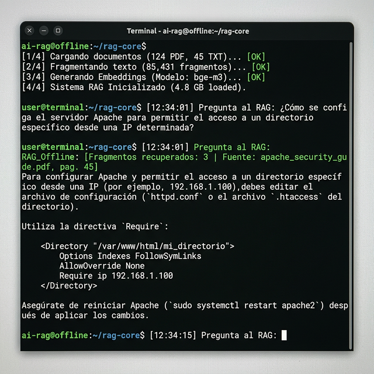

# Sistema RAG Offline - Asistente Técnico Industrial



Asistente basado en Inteligencia Artificial (Retrieval-Augmented Generation) para documentación técnica con funcionamiento 100% offline.

## Características
- **Privacidad Total**: No requiere conexión a internet, ideal para plantas o entornos aislados.
- **Búsqueda Avanzada**: Uso de base de datos vectorial FAISS y patrones LCEL para respuestas rápidas.
- **Análisis de Archivos**: Procesamiento de grandes manuales de PLC, PDFs y normativas.
- **Respuestas Instantáneas**: Obtén información precisa en milisegundos.

## Requisitos
- Python 3.8+

## Instalación y Uso
1. Navega a la carpeta principal del programa:
   ```bash
   cd Programa_RAG
   ```
2. Instala las dependencias:
   ```bash
   pip install -r requirements.txt
   ```
3. Ejecuta la aplicación de consola:
   ```bash
   python main_rag.py
   ```

## Estructura
- `Programa_RAG/`: Código del motor RAG.
- `Documentacion/`: Información, investigación y bitácora del desarrollo.
